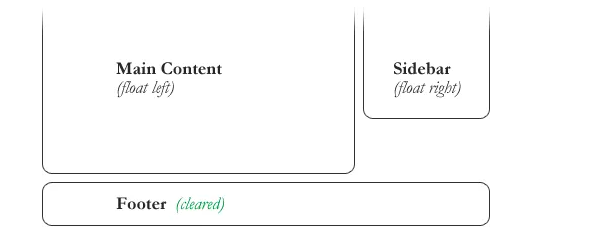

# CSS-interview-questions
> Contains basic and advanced questions


## ***Question: What does float do?***

**Answer:** float pushes an element to the sides of a page with text wrapped around it. you can create entire page or a smaller area by using float. if size of a floated element changes, text around it will re-flow to accommodate the changes. You can have float left, right, none or inherit.

if you set, 'float: left;' for an image, it will move to the left until the margin, padding or border of another block-level element is reached. The normal flow will wrap around on the right side.

Note: Absolutely positioned elements ignore the float property!

**Example**
```html
 <style>
   .floatContainer{
        width: 200px;
        height: 100px;
        border: 2px solid purple;
   }
   .box{
        float: left;
        width: 50px;
        height: 30px;
        border: 2px solid gray;
        margin: 5px;
   }
 </style>
 <div class="container">
    <div class="box"><span>1</span></div>
    <div class="box"><span>2</span></div>
    <div class="box"><span>3</span></div>
    <div class="box"><span>4</span></div>
    <div class="box"><span>5</span></div>
  </div> 
  ```
## ***Question: How can you clear sides of a floating element***
**Answer:** Float’s sister property is clear. An element that has the clear property set on it will not move up adjacent to the float like the float desires, but will move itself down past the float. Again an illustration probably does more good than words do.

The clear property is directly related to floats. If the element can fit horizontally in the space next to another element which is floated, it will. Unless you apply clear to that element in the same direction as the float. Then the element will move down below the floated element.

Here’s a simple example of a layout constructed with floats, which could be problematic for the footer:


But by clearing the footer element, the layout snaps into place:
```html

#footer {
   clear: both;
}
```


In this case, clear: both; was used to ensure the footer clears past elements that are floated in either direction. But you can also clear either left or right in which case the element will move below elements that are floated that direction, but not the other.

A common way to clear floats is to apply a pseudo-element to a container element which clears the float

## ***Question: How can you fix, "floated points don't add up to the height of a parent"?***

**Answer:** You can use clear: both in an empty div <div style="clear: both;"></div>, you can use overflow hidden or scroll and you can float the parent as well.

## ***Question: Does css properties are case sensitive?***

**Answer:** no.

## ***Question: Why css selectors mixed up with cases don't apply the styles?***

 **Answer:** because, html ID and classes are case sensitive.

## ***Question: Does margin-top or margin-bottom has effect on inline element?***

**Answer:** no.

## ***Question: Does padding-top or padding-bottom has effect on inline element?***

**Answer:** no.

## ***Question: Does padding-left or padding-right or margin-left or margin-right has effect on inline element?***

**Answer:** yes.

## ***Question: If you have a <p> element with font-size: 10rem, will the text be responsive when the user resizes / drags the browser window?***

**Answer:** no.

## ***Question: The pseudo class :checked will select inputs with type radio or checkbox, but not <option> elements.***

**Answer:** False

## ***Question: In a HTML document, the pseudo class :root always refers to the <html> element.***

**Answer:** True

## ***Question: The translate() function can move the position of an element on the z-axis.***

**Answer:** False

## ***Question: Which one would you prefer among px, em % or pt and why?***

**Answer:** it depends on what you are trying to do.

-   px gives fine grained control and maintains alignment because 1 px or multiple of 1 px is guaranteed to look sharp. px is not cascade, this means if parent font-size is 20px and child 16px. child would be 16px.

-   em maintains relative size. you can have responsive fonts. em is the width of the letter 'm' in the selected typeface. However, this concept is tricky. 1em is equal to the current font-size of the element or the browser default. if u sent font-size to 16px then 1em = 16px. The common practice is to set default body font-size to 62.5% (equal to 10px). em is cascade

-   % sets font-size relative to the font size of the body. Hence, you have to set font-size of the body to a reasonable size. this is easy to use and does cascade. for example, if parent font-size is 20px and child font-size is 50%. child would be 10px.

-   pt(points) are traditionally used in print. 1pt = 1/72 inch and it is fixed-size unit.


## ***Question: How absolute, relative, fixed and static position differ?***

**Answer:**

-   absolute, place an element exactly where you want to place it. absolute position is actually set relative to the element's parent. if no parent available then relatively place to the page itself.

-   relative, is position an element relative to itself (from where the element would be placed, if u don't apply relative positioning). for example, if u set position relative to an element and set top: 10px, it will move 10px down from where it would be normally.

-   fixed, element is positioned relative to viewport or the browser window itself. viewport doesn't changed if u scroll and hence fixed element will stay right in the same position.

-   static, element will be positioned based on the normal flow of the document. usually, u will use position static to remove other position might be applied to an element.

## ***Question: What are the differences between visibility hidden and display none?***
**Answer:**
> - `display:none` means that the element will not appear on the page at all (although you can still interact with it through the dom). There will be no space allocated for it between other tags.
> - `visibility:hidden` means that unlike `display:none`, the element is not visible, but space is allocated for it on the page. The element is rendered, it just isn't seen on the page.

## ***Question: Describe `inline`, `inline-block`, and `block` display elements***

**Answer:**
- Inline Elements: don’t start on a new line, they appear on the same line as the content and tags beside them. Some examples of inline elements are `<span>` , `<strong>`, and `` tags.
- Inline-block Elements: are similar to inline elements, except they can have padding and margins added on all four sides. You’ll have to declare `display: inline-block` in your CSS code.
- Block Elements: always starts on a new line, and fills up the horizontal space left and right on the web page. You can add margins and padding on all four sides of any block element — top, right, left, and bottom. Some examples of block elements are `<div>` and `<p>` tags

## ***Question: What’s the difference between “resetting” and “normalizing” CSS? Which would you choose, and why?***

**Answer:**
-   Resetting is meant to strip all default browser styling on elements. For e.g. margins, paddings, font-sizes of all elements are reset to be the same. You will have to redeclare styling for common typographic elements.

-   Normalizing preserves useful default styles rather than “unstyling” everything. It also corrects bugs for common browser dependencies.\
I would choose resetting when I have very a customized or unconventional site design such that I need to do a lot of my own styling do not need any default styling to be preserved.

## ***Question: Describe z-index and how stacking context is formed***

**Answer:**
The Z-index is a property that allows the developer to stack elements in the CSS. It’s basically a 3-d property so it allows the developer to choose how close the element appears. This is how stacking context is formed.\
`z-index` tells how elements should be stacked in a screen. Stacking context can be formed in several situations, but most famously, by a root element and positioned elements. In each stacking context, `z-index` will be calculated separately for its children and will stack the children in ascending order.

## ***Question: Explain CSS sprites, and how you would implement them on a page or site.***

**Answer:**
CSS sprite is combining multiple images into a merged one image and use CSS to render each of them properly for each element. It's usually implemented using `background: url(...) x-axis y-axis;`, or both `background-image` and `background-position`. This technique saves on multiple HTTP requests but can be a pain to compile, as any changes to the sprite image will need to have the CSS updated with any new positions.
 - With HTTP2 though, having multiple images loaded is no longer much of an issue.

## ***Question: What is the difference between classes and IDs in CSS?***

**Answer:**
-   ids are unique: Each element can have only one id, Each page can have only one element with that id
-   classes are NOT unique: You can use the same class on multiple elements, You can use multiple classes on the same element.
-   Javascript cares: JavaScript people are already probably more in tune with the differences between classes and ids. JavaScript depends on there being only one page element with any particular id, or else the commonly used `getElementById` function couldn't be depended on.

## ***Question: What are your favorite image replacement techniques and which do you use when?***
**Answer:** CSS image replacement is a technique of replacing a text element (usually a header tag like an `<h1>`) with an image (often a logo). It has its origins in the time before web fonts and SVG [more...](https://css-tricks.com/the-image-replacement-museum/)

## ***Question: How would you approach fixing browser-specific styling issues?***
  
**Answer:** With Use a separate stylesheet that only loads when that specific browser is being used. Thankfully, the days of IE specific stylesheets are almost [gone](https://css-tricks.com/how-to-create-an-ie-only-stylesheet/).

## ***Question:How do you serve your pages for feature-constrained browsers? What techniques/processes do you use?***
  
**Answer:** Polyfills or graceful degradation using library like [modernizr](https://modernizr.com/)

## ***Question: What are the different ways to visually hide content (and make it available only for screen readers)?***

**Answer:**
  > - You can use `visibility: hidden;` or `display:none`
  > - You can set the dimension `width:0; height:0;`
  > - Using `text-indent: -10000px;` to hide the content off display
  > - Using `position: absolute` & `clip: rect(1px, 1px, 1px, 1px)`

## ***Question: Is there any reason you'd want to use translate() instead of absolute positioning, or vice-versa? And why?***

**Answer:** Yes, translate do not cause the browser to trigger [repaint and layout](https://developers.google.com/web/fundamentals/performance/rendering/) and instead only acts on the compositor. I tend to only ever use translate/transform nowadays, and only using absolute positioning for elements initial position. I'll then translate it from that initial position for better performance.

## ***Question: What are the advantages/disadvantages of using CSS preprocessors? Describe what you like and dislike about the CSS preprocessors you have used.***

**Answer:**
  > - Pros: Nested tags, Mixins, Importing other styles in, Modularity
  > - Cons: Nested tags are hard to read after a certain point, Have to use build tools to compile, Easy to abuse (@extend in sass)

## ***Question: Explain how a browser determines what elements match a CSS selector.***

**Answer:**
 > - CSS Selectors are matched by browser engines from right to left consider `#menu ul li a { color: #00f; }` The browser first checks for `a`, then `li`, then `ul`, and then `#menu`.
  > - Check matching elements for the key(right-most) selector
  > - Check if the elements are matching parents for the next selectors


## ***Question: What does `* { box-sizing: border-box; }` do? What are its advantages?***

**Answer:**
-   Apply a natural box layout model to all elements. 
-   If you set an element width to 300px and if you apply 10px padding then the rendered element on browser would take 300 + leftmargin 20 + rightmargin 20 = total of 340px in width. If you give `box-sizing: border-box` the padding is applied right inside your box model and rendered width would be 300px irrespective of padding / border used. Also the content section in the element shrinks in order to not take more the 300px width.
  ```css
  html {
    box-sizing: border-box;
  }
  
  *, *:before, *:after {
    box-sizing: inherit;
  }
  ```
## ***Question: Describe pseudo-elements and discuss what they are used for.***

**Answer:**
- It's to style a part of an element, like `::first-letter` or `::before`. They can be used to add a special symbol before a paragraph, change color of first character of a line, etc.
- These are appropriately called pseudo "elements" (not selectors) because they don't select any "real" element that exists on the page


## ***Question: What's HTML5 shim, what's its usage***

**Answer:**
   - The HTML5 Shiv enables use of HTML5 sectioning elements in legacy Internet Explorer and provides basic HTML5 styling for Internet Explorer 6-9, Safari 4.x (and iPhone 3.x), and Firefox 3.x.
   - Pretty much not needed now as most of the browser as on _12 Sep 2017_ supports sectioning elements

## ***Question: What is Media Queries and why it's used?***

**Answer:**

   - The goal of responsive design is creating the right experience for the right device.
   - With a gazillion different devices on the market, this can be a big task. Media queries helps us achieve our goal of creating right experience for the right device. 
   - CSS Media queries allow us to target CSS rules based on - for instance - screen size, device-orientation or display-density. This means you can use CSS Media Queries to tweak a CSS for an iPad, printer or create a responsive site.
   - Media queries are useful when you want to apply CSS styles depending on a device's general type (such as print vs. screen), specific characteristics (such as the width of the browser viewport). With the huge variety of internet-connected devices available today, media queries are a vital tool for building websites and apps that are robust enough to work on whatever hardware your users have.

-  Media quries sample code
  ```css
  /* Print */
  @media print { ... }

  /* Screen with maximum width of 1024px */
  @media screen (max-width: 1024px) { ... }

  /* Screen and Print */
  @media screen, print { ... }
  ```

## ***Overflow***
> - Every single element on a page is a rectangular box. If you don't set the height of a box, the height of that box will grow as large as it needs to be to accommodate the content. But what happens when you do set a specific height or width on a box, and the content inside cannot fit? That is where the CSS overflow property comes in, allowing you to specify how you would like that handled.
  > - There are four values for the overflow property: `visible` (default), `hidden`, `scroll`, and `auto`. There are also sister properties `overflow-y` and `overflow-x`, which enjoy less widespread adoption.

## ***Pseudo classes***
> - A CSS pseudo-class is a keyword added to a selector that specifies a special state of the selected element(s). For example, `:hover` can be used to change a button's color when the user hovers over it. Few examples shown below (Full Reference - https://css-tricks.com/pseudo-class-selectors/)
  > - Link related
  >   - `:link` this is essentially the same as a[href].
  >   - `:visited` already been visited by the current browser.
  >   - `:hover` mouse cursor rolls over a link, it's hover state.
  >   - `:active` being clicked on or otherwise activated.
  > - Input
  >   - `:focus` puts cursor on the input field thus making it ready to enter data
  > - Position Based
  >   - `:first-child` Selects the first element within a parent
  >   - `:last-child` Selects the last element within a parent
  >   - `:nth-child()` Selects elements based on a simple provided algebraic expression (e.g. "2n" or "4n-1")


## ***CSS Selectors***
  
  > - CSS selectors define the elements to which a set of CSS rules apply.
  > - **Basic Selectors**
  >    - Element selector (`input`)
  >    - Class selector (`.class-name`)
  >    - ID selector (`#id-name`)
  >    - Universal selector (`*`)
  >    - Attribute selector (`[attr]`, (`[attr~=value]`, (`[attr*=value]`, etc.,)
  > - **Combinators**
  >    - Adjacent sibling combinator (`+`) (Eg.) `h2 + p` will match all `<p>` elements that directly follow an `<h2>`.
  >    - General sibling combinator ('~') (Eg.) `p ~ span` will match all `<span>` elements that follow a `<p>`.
  >    - Child combinator ('>') (Eg.) `ul > li` will match all `<li>` elements that are nested directly inside a `<ul>` element.
  >    - Descendant combinator (' ') (Eg.) `div span` will match all `<span>` elements that are inside a `<div>` element.
  > - **Pseudo-classes**
  >    - Selection of elements based on state information that is not contained in the document tree. (Eg.) `a:visited` will match all `<a>` elements that have been visited by the user.
  > - **Pseudo-elements**
  >    - Represent entities that are not included in HTML. (Eg.) `p::first-line` will match the first line of all `<p>` elements.

## ***@import***

  > - The @import CSS at-rule is used to import style rules from other style sheets / paths
  >   ```css
  >   /* Syntax  */
  >   @import url;
  >   @import url list-of-media-queries;
  >
  >   /* Example */
  >   @import url("fineprint.css") print;
  >   @import 'custom.css';
  >   @import "common.css" screen, projection;
  >   @import url('landscape.css') screen and (orientation:landscape);
  >   ```

- [ ] - Animations
- [ ] - Transitions
- [ ] - Sass, Less
- [ ] - Calc()
- [ ] - Variables in css
- [ ] - currentColor
- [ ] - backface-visibility.
- [ ] - translate
- [ ] - Gradients, Text shadows
- [ ] - Cross browser issues in CSS
- [ ] - Cross browser testing
- [ ] - SVG and its benefits

#### Concepts

- [ ] - Specificity
- [ ] - Box model
- [ ] - Margin collapsing
- [ ] - FOUC (flash of unstyled content)
- [ ] - CSS Methodologies (BEM, OOCSS etc,.)
- [ ] - RWD (Responsive Web Design)

#### Generic Questions

- [x] Have you played around with the new CSS Flexbox or Grid specs?

  > Flexbox is fantastic and I suggest that everyone starts using it. It especially makes it easy to vertically center elements.
  > [CSS Grid](https://developer.mozilla.org/en-US/docs/Web/CSS/CSS_Grid_Layout) is looking to be amazing. I haven't used it yet, but I'm sure it'll start taking place of some more popular grid frameworks.
  


#### Reference:
- [CSS Tricks](https://css-tricks.com/interview-questions-css/)
- [CSS: interview questions](https://thatjsdude.com/interview/css.html)
- [Frontend Developer Interview Questions](https://github.com/h5bp/Front-end-Developer-Interview-Questions)
